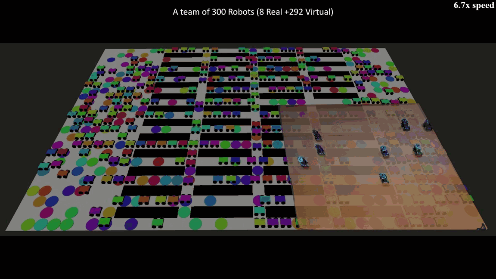

<h1 align="center">P3GASUS: Pre-Planned Path Execution Graphs for Multi-Agent Systems at Ultra-Large Scale</h1>

<div align="center">

[[Website]](https://marmotlab.github.io/P3GASUS/)
[[Paper]](https://ieeexplore.ieee.org/document/11282966)
[[Graph Creation Code]](https://github.com/marmotlab/P3GASUS-graph-creation)

[](https://www.ros.org/)
[](https://ubuntu.com/)
[](LICENSE.md)



</div>

---

## Updates

- [x] Release ROS execution framework
- [x] Release standalone graph creation repository
- [x] Release C++/Pybind version of graph creation
- [x] Release project website
<!-- - [x] Release discrete and continuous benchmark assets -->
<!-- - [ ] Complete ROS codebase refactor -->

## Overview

[P3GASUS](https://ieeexplore.ieee.org/document/11282966) is a ROS-based framework for robust distributed execution of pre-planned paths in ultra-large multi-agent systems. It supports both discrete multi-agent path finding (MAPF) and continuous traffic-style coordination.

P3GASUS introduces faster execution-graph builders for pre-planned multi-agent paths:

- **SAGE:** builds ADG-equivalent execution graphs while avoiding exhaustive action-space search.
- **MAGE:** removes redundant graph edges to reduce communication during execution.
- **FORTED:** builds reduced discrete-space execution graphs in O(RT).

If you only need the graph creation algorithms, use the standalone repository: [P3GASUS-graph-creation](https://github.com/marmotlab/P3GASUS-graph-creation).

> **Note:** The ROS codebase is currently being refactored. If you encounter issues, please [open an issue](https://github.com/marmotlab/P3GASUS/issues).

---

## Installation

Follow these steps to set up P3GASUS in a ROS 1 catkin workspace.

1. **Install ROS 1:**

   P3GASUS requires one of the following ROS distributions:

   - [ROS Melodic](https://wiki.ros.org/melodic/Installation/Ubuntu)
   - [ROS Noetic](https://wiki.ros.org/noetic/Installation/Ubuntu)

2. **Clone this repository into your catkin workspace:**

   ```bash
   cd ~/catkin_ws/src
   git clone https://github.com/marmotlab/P3GASUS.git
   ```

3. **Build the ROS workspace:**

   ```bash
   cd ~/catkin_ws
   catkin_make
   source devel/setup.bash
   ```

4. **Clone the graph creation repository:**

   ```bash
   cd ~
   git clone https://github.com/marmotlab/P3GASUS-graph-creation.git
   ```

5. **Configure P3GASUS paths and bindings:**

   Edit [`scripts/parameters.py`](scripts/parameters.py):

   ```python
   PATH_TO_P3GASUS_GRAPH_CREATION = "<your path>/P3GASUS-graph-creation"
   GRAPH_BINDINGS = "python"  # "python" or "cpp"
   ```

6. **Optional: build the faster C++ graph bindings:**

   ```bash
   cd <your path>/P3GASUS-graph-creation/binding
   python setup.py build_ext --inplace
   ```

   Then switch the binding mode in [`scripts/parameters.py`](scripts/parameters.py):

   ```python
   GRAPH_BINDINGS = "cpp"
   ```

---

## Quick Start

**Terminal 1: initialize the driver**

```bash
roslaunch p3gasus driver.py
```

**Terminal 2: run one simulation**

```bash
rosrun p3gasus oneRun.py
```

If ROS reports that a script is not executable, run:

```bash
chmod +x <filename.py>
```

---

## Configuration

Most experiment settings live in [`scripts/parameters.py`](scripts/parameters.py).

Common options include:

- `DriverParameters.SCENARIO`: set to `0` for discrete MAPF or `1` for continuous traffic.
- `GRAPH_BINDINGS`: set to `"python"` or `"cpp"`.
- `HYBRID_ROBOT_COUNT`: number of robots in the environment.
- `GROUP_COUNT`: number of parallel processing groups.
- `REAL_WORLD_SIZE`: map extents.
- `DEBUG`: enable verbose logging.

### Discrete MAPF

Discrete settings include:

- `MAPFParameters.WORLD`: occupancy grid.
- `MAPFParameters.STARTS`: start and goal pairs.
- `SAFETY_DISTANCE`: collision buffer.
- `VIRTUAL_FAST_VEL`, `VIRTUAL_SLOW_VEL`: virtual robot velocity limits.
- `REAL_FAST_VEL`, `REAL_SLOW_VEL`: real robot velocity limits.

For discrete multi-agent path planning, P3GASUS uses [LACAM3](https://github.com/Kei18/lacam3/tree/pybind). Pre-built bindings for Python 3.8 and 3.11 are included; other Python versions require rebuilding the bindings.

### Continuous Traffic

Continuous settings include:

- `TrafficParameters.ORIGIN`: map anchor point.
- `FUTURE_TASKS`: look-ahead task queue length.
- `FAR_THRESHOLD`, `REACH_THRESHOLD`: distance thresholds.
- `VIRTUAL_MIN_VEL`, `VIRTUAL_MAX_VEL`: virtual velocity window.
- `REAL_SLOW_VEL`, `REAL_FAST_VEL`: real robot velocity limits.
- `SPEED_MULTIPLIER`: global speed scaling.

---

## Hybrid Real-Robot Demo

P3GASUS supports hybrid execution with simulated agents and real robots tracked by motion capture.

The included hardware pipeline was developed for an OptiTrack motion capture system and SparkFun mecanum-wheeled robots. If you use different hardware, you may need to adapt ROS topics, robot drivers, and network configuration.

Relevant settings in [`scripts/parameters.py`](scripts/parameters.py):

- `VIRTUAL_TO_REAL_ROBOT_MAPPING`: maps virtual agent indices to physical robot IDs.
- `OPTITRACK_TO_MAP_SHIFT`: aligns the motion-capture frame with the map frame.
- `VRPN_IP`: OptiTrack VRPN server address.
- `ROS_MASTER_IP`, `REAL_ROBOT_IP`: ROS networking addresses.

---

## Repository Structure

| Directory | Contents |
|-----------|----------|
| `scripts/` | Main Python drivers, controllers, utilities, and parameter configuration |
| `launch/` | ROS launch files |
| `map/` and `worlds/` | Example maps and Gazebo worlds |
| `urdf/` | Robot and goal description files |
| `msg/` | Custom ROS message definitions |
| `rviz/` | RViz visualization configurations |
| `docs/` | GitHub Pages website |

---

## Website

The project website is served from [`docs/`](docs/) through GitHub Pages:

```text
https://marmotlab.github.io/P3GASUS/
```

To preview it locally:

```bash
python docs/serve.py
```

---

## Credit

If you find this work useful, please consider citing:

```bibtex
@ARTICLE{11282966,
  author={Duhan, Tanishq and He, Chengyang and Sartoretti, Guillaume},
  journal={IEEE Robotics and Automation Letters},
  title={P3GASUS: Pre-Planned Path Execution Graphs for Multi-Agent Systems at Ultra-Large Scale},
  year={2026},
  volume={11},
  number={2},
  pages={1274-1281},
  keywords={Robots;Collision avoidance;Delays;Synchronization;Robot kinematics;Multi-agent systems;Time complexity;Standards;Global communication;Artificial intelligence;Distributed robot systems;path planning for multiple mobile robots;software architecture for robotics},
  doi={10.1109/LRA.2025.3641121}
}
```

## Support

For questions, bugs, or setup issues, please [open an issue](https://github.com/marmotlab/P3GASUS/issues) with your ROS version, Python version, and steps to reproduce.
